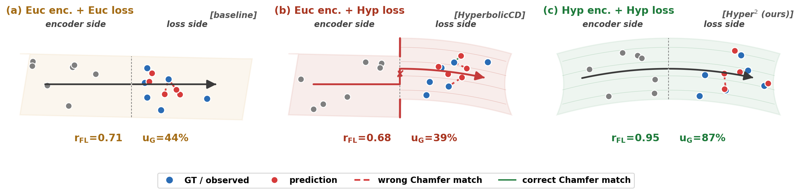
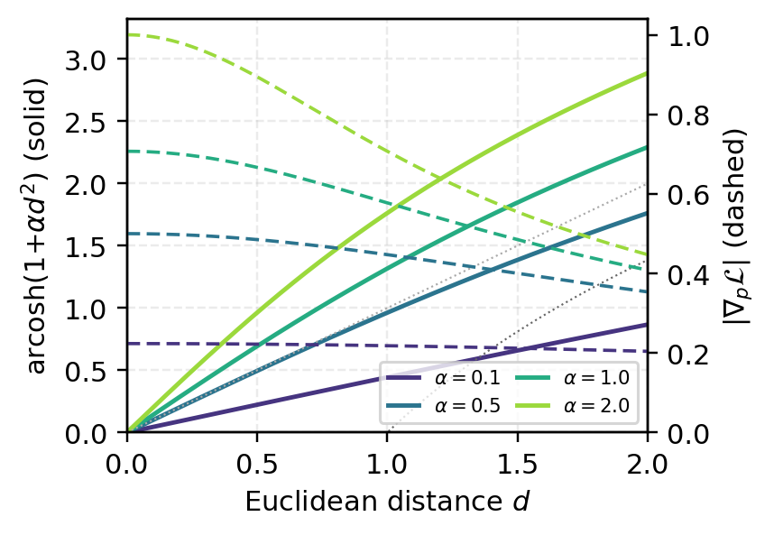
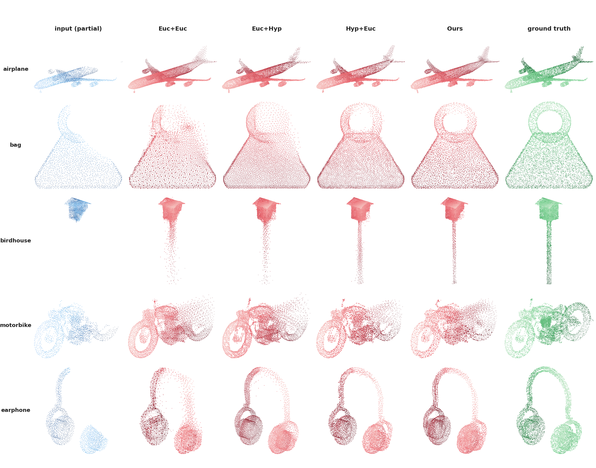

# Hyper² : Unleashing Hyperbolic Geometry's Full Potential via Dual-Space Consistency

> **Hyper²** is a point-cloud-completion framework that places the **same**
> `arcosh(1 + α·d²)` non-linearity at *both* ends of the network — as a
> positional bias inside the refinement attention **and** as the Chamfer
> training loss — under a single shared curvature `α`.
>
> This dual-space consistency closes the *cross-geometry mismatch* that has
> bottlenecked previous hyperbolic completion methods, and delivers
> **−22.9 % Chamfer on ShapeNet-55**, **−37.5 % on the 21 unseen ShapeNet-34
> categories**, and SOTA on the **KITTI LiDAR** benchmark — at only
> **~1.6 % extra FLOPs** over the SVDFormer backbone.

<p align="center">
  
</p>

---

## Table of Contents

- [Motivation: The Cross-Geometry Mismatch](#motivation-the-cross-geometry-mismatch)
- [Method Overview](#method-overview)
- [Why the `arcosh(1+αd²)` Shape?](#why-the-arcosh1αd-shape)
- [Results](#results)
  - [ShapeNet-55](#shapenet-55)
  - [ShapeNet-34 (Seen + 21 Unseen)](#shapenet-34-seen--21-unseen)
  - [PCN](#pcn)
  - [KITTI (Real LiDAR)](#kitti-real-lidar)
  - [Ablation: Dual-Space Consistency](#ablation-dual-space-consistency)
  - [Ablation: Curvature α](#ablation-curvature-α)
- [Qualitative Comparison](#qualitative-comparison)
- [Computational Overhead](#computational-overhead)
- [Getting Started](#getting-started)
  - [Environment](#environment)
  - [Datasets](#datasets)
  - [Training](#training)
  - [Testing / Evaluation](#testing--evaluation)
- [Repository Structure](#repository-structure)
- [Acknowledgements](#acknowledgements)
- [Citation](#citation)
- [License](#license)

---

## Motivation: The Cross-Geometry Mismatch

HyperbolicCD pioneered hyperbolic geometry for point cloud completion by
replacing the Euclidean Chamfer distance with `arcosh(1 + α‖x−y‖²)`, but
the reported gains were modest (3–7 % across SeedFormer, PointAttN and
PMP-Net backbones on PCN / ShapeNet-55) — far below what the underlying
geometry should afford.

**Our diagnosis.** The loss is hyperbolic, but the encoder it
back-propagates through is *Euclidean*. The hyperbolic loss produces
*position-dependent* gradients, yet the chain rule through a Euclidean
encoder averages this position-dependence away. We call this a
**cross-geometry mismatch** and make it testable via two model-agnostic
diagnostic indicators:

- **Feature–loss correlation**  `r_FL := E[Pearson(s^F, s^L)] ∈ [-1, 1]`
- **Effective gradient utilisation**  `u_G := 1 − E[(s^L − β·g*)²] / Var[s^L]`

where `s^F = arcosh(1 + α·d²)` is the encoder's incompleteness scalar,
`s^L = ‖∂L/∂x‖` the loss-gradient magnitude, and `g*` the analytic
per-point gradient predicted by the hyperbolic Chamfer loss.

> On SVDFormer + HyperbolicCD (Euc-encoder + Hyp-loss) we measure
> **(r_FL, u_G) = (0.68, 39 %)**. Closing the mismatch with Hyper²
> lifts these to **(0.95, 87 %)** — and *only* the dual-space row
> moves them together.

<p align="center">
  
</p>

<p align="center"><i>
Each panel draws encoder (left) and loss (right) as the two halves of one
2-D manifold joined at a vertical seam.
<b>(a) Euc + Euc</b> [baseline] — flat seam, flat flow, wrong (red) matches
dominate. <b>(b) Euc + Hyp</b> [HyperbolicCD] — flat meets curved, a
geometric kink at the seam forces the flow across a discontinuity.
<b>(c) Hyp + Hyp</b> [Hyper², ours] — one continuous curved manifold;
smooth seam, the flow follows the arc, and (r_FL, u_G) jump to (0.95, 87 %).
</i></p>

---

## Method Overview

We build on the coarse-to-fine refinement architecture of
**SVDFormer**, where the partial input `P_in` is encoded into a coarse
prediction `P_0` and iteratively refined into `P_1`, `P_2`. **Hyper²
makes two surgical changes**:

1. **Hyperbolic distance encoding** — inside every refinement stage we
   replace SVDFormer's linear positional bias `d_i / γ` with
   `e_i = arcosh(1 + α·d_i²)`, fed through the same sinusoidal
   embedding into self-attention.  Near points stay approximately
   Euclidean (`≈ √(2α)·d`); far points are log-compressed
   (`≈ log(2αd²)`) and can no longer monopolise the attention budget.
2. **Hyperbolic Chamfer loss** — we pair the encoder with HyperbolicCD's
   loss form, under the **same** scalar curvature `α`:
   `L = (1/|P|) Σ_p arcosh(1 + α·‖p − NN(p, Q)‖²) + sym.`

Both operators are `O(N log N)` scalar non-linearities on Euclidean
distances over a standard KNN graph — no manifold projection, no
boundary instability, no Poincaré-ball machinery — adding only ~1.6 %
FLOPs over SVDFormer.

<p align="center">
  
</p>

<p align="center"><i>
Partial input <code>P<sub>in</sub></code> is encoded by the self-view
backbone (point-level + pixel-level aggregation) and passed to the
refinement network. The two <b>Hyper Embedding</b> blocks mark where
Hyper² injects <code>arcosh(1+αd²)</code> as a positional bias on the
refinement attention; the three output stages <code>P<sub>0</sub></code>,
<code>P<sub>1</sub></code>, <code>P<sub>2</sub></code> are each
supervised by the hyperbolic Chamfer loss. Both ends share the same
scalar <code>α</code>.
</i></p>

### HyperEmbedding refinement module

<p align="center">
  
</p>

<p align="center"><i>
We keep SVDFormer's feature embedding + self-/cross-attention + decoder
verbatim and replace <b>only</b> its positional bias. The right panel
zooms in on the change: distance lookup → <code>arcosh(1+α·d²)</code> →
sinusoidal embedding. Sub-linear in <code>d</code>, γ-free, single shared
<code>α</code> with the loss.
</i></p>

### Position-dependent supervision through the chain rule

With the dual-space configuration the parameter gradient factors as

```
∂L/∂θ  =  arcosh'(1+αd²)   ·   ∂p/∂h^H   ·   arcosh'(1+αd²)   ·   ∂d/∂θ
         ───────────────       ─────────       ───────────────
         loss-side             attention       encoder-side
```

Two of the four factors carry the **same** `arcosh'(1+α·d²)`
position-dependence. The attention block is linear in its inputs and
cannot create this shape itself, so under dual-space consistency the
shape *survives* the chain rule; under any single-space configuration
the softmax washes it out across points. This is exactly what the
diagnostic indicators measure.

---

## Why the `arcosh(1+αd²)` Shape?

<p align="center">
  
</p>

- **Value (solid).** Approximately `√(2α)·d` near `d = 0` (Euclidean,
  fine-grained), saturating to `log(2αd²)` for large `d` (log-compressed).
- **Gradient (dashed).** Bounded by `√(2α)` at `d = 0`; decays as `2/d`
  for large `d`.

This is a **"no-vanish, no-explode"** loss — coarse and fine errors get
comparable priority, and a single far outlier cannot dominate the
Chamfer term. The same shape, re-used as a positional bias on the
encoder side, gives the model a *hierarchical* attention budget over
its incompleteness field.

---

## Results

All numbers are from our paper. Best in **bold**.

### ShapeNet-55

ℓ² Chamfer × 10³ (lower is better) and F1@1 % (higher is better). CD-S /
M / H = simple / moderate / hard difficulty (25 / 50 / 75 % missing).

| Method | CD-S | CD-M | CD-H | **CD-Avg ↓** | DCD ↓ | F1 ↑ |
| :-- | :--: | :--: | :--: | :--: | :--: | :--: |
| FoldingNet | 2.67 | 2.66 | 4.05 | 3.12 | — | 0.082 |
| PCN | 1.94 | 1.96 | 4.08 | 2.66 | 0.618 | 0.133 |
| TopNet | 2.26 | 2.16 | 4.30 | 2.91 | — | 0.126 |
| PFNet | 3.83 | 3.87 | 7.97 | 5.22 | — | 0.339 |
| GRNet | 1.35 | 1.71 | 2.85 | 1.97 | 0.592 | 0.238 |
| PoinTr | 0.58 | 0.88 | 1.79 | 1.09 | 0.575 | 0.464 |
| SeedFormer | 0.50 | 0.77 | 1.49 | 0.92 | 0.558 | 0.472 |
| SVDFormer | 0.48 | 0.70 | 1.30 | 0.83 | 0.541 | 0.451 |
| **Hyper² (Ours)** | **0.37** | **0.55** | **1.01** | **0.64** | **0.528** | **0.523** |

> **−22.9 % CD over SVDFormer**, **−30.4 % over SeedFormer**, with the
> relative gain roughly constant across difficulty levels (−22.9 % /
> −21.4 % / −22.3 % on S / M / H).

### ShapeNet-34 (Seen + 21 Unseen)

ℓ² Chamfer × 10³ ↓ / F1@1 % ↑.

| Method | \| 34 seen \| CD-S | CD-M | CD-H | **CD-Avg ↓** | F1 ↑ | \| 21 unseen \| CD-S | CD-M | CD-H | **CD-Avg ↓** | F1 ↑ |
| :-- | --: | --: | --: | --: | --: | --: | --: | --: | --: | --: |
| FoldingNet | 1.86 | 1.81 | 3.38 | 2.35 | 0.139 | 2.76 | 2.74 | 5.36 | 3.62 | 0.095 |
| PCN | 1.87 | 1.81 | 2.97 | 2.22 | 0.154 | 3.17 | 3.08 | 5.29 | 3.85 | 0.101 |
| TopNet | 1.77 | 1.61 | 3.54 | 2.31 | 0.171 | 2.62 | 2.43 | 5.44 | 3.50 | 0.121 |
| PFNet | 3.16 | 3.19 | 7.71 | 4.68 | 0.347 | 5.29 | 5.87 | 13.33 | 8.16 | 0.322 |
| GRNet | 1.26 | 1.39 | 2.57 | 1.74 | 0.251 | 1.85 | 2.25 | 4.87 | 2.99 | 0.216 |
| PoinTr | 0.76 | 1.05 | 1.88 | 1.23 | 0.421 | 1.04 | 1.67 | 3.44 | 2.05 | 0.384 |
| SeedFormer | 0.48 | 0.70 | 1.30 | 0.83 | 0.452 | 0.61 | 1.07 | 2.35 | 1.34 | 0.402 |
| SVDFormer | 0.46 | 0.65 | 1.13 | 0.75 | 0.457 | 0.61 | 1.05 | 2.19 | 1.28 | 0.402 |
| **Hyper² (Ours)** | **0.38** | **0.53** | **0.95** | **0.62** | **0.506** | **0.44** | **0.65** | **1.30** | **0.80** | **0.465** |

> **−17.3 % CD on seen**, **−37.5 % CD on the 21 unseen categories** —
> consistent with the framework helping most when the hierarchy is
> hardest to recover.

### PCN

ℓ¹ Chamfer × 10³ ↓.

| Method | Plane | Cabinet | Car | Chair | Lamp | Couch | Table | Boat | **CD-Avg ↓** | DCD ↓ | F1 ↑ |
| :-- | --: | --: | --: | --: | --: | --: | --: | --: | --: | --: | --: |
| PCN | 5.50 | 22.70 | 10.63 | 8.70 | 11.00 | 11.34 | 11.68 | 8.59 | 9.64 | — | 0.695 |
| GRNet | 6.45 | 10.37 | 9.45 | 9.41 | 7.96 | 10.51 | 8.44 | 8.04 | 8.83 | 0.622 | 0.708 |
| CRN | 4.79 | 9.97 | 8.31 | 9.49 | 8.94 | 10.69 | 7.81 | 8.05 | 8.51 | — | 0.652 |
| NSFA | 4.76 | 10.18 | 8.63 | 8.53 | 7.03 | 10.53 | 7.35 | 7.48 | 8.06 | — | 0.734 |
| PoinTr | 4.75 | 10.47 | 8.68 | 9.39 | 7.75 | 10.93 | 7.78 | 7.29 | 8.38 | 0.611 | 0.745 |
| SnowflakeNet | 4.29 | 9.16 | 8.08 | 7.89 | 6.07 | 9.23 | 6.55 | 6.40 | 7.21 | 0.585 | 0.801 |
| PMP-Net++ | 4.39 | 9.96 | 8.53 | 8.09 | 6.06 | 9.82 | 7.17 | 6.52 | 7.56 | 0.611 | 0.781 |
| FBNet | 3.99 | 9.05 | 7.90 | 7.38 | 5.82 | 8.85 | 6.35 | 6.18 | 6.94 | — | — |
| SeedFormer | 3.85 | 9.05 | 8.06 | 7.06 | 5.21 | 8.85 | 6.05 | 5.85 | 6.74 | 0.583 | 0.818 |
| SVDFormer | 3.62 | 8.79 | 7.46 | 6.91 | 5.33 | 8.49 | 5.90 | 5.83 | 6.54 | 0.536 | 0.841 |
| **Hyper² (Ours)** | **3.52** | **8.54** | **7.31** | **6.60** | **5.19** | **8.27** | **5.83** | **5.67** | **6.36** | **0.528** | **0.854** |

> Best on **every** category. −2.8 % over SVDFormer, −5.6 % over
> SeedFormer; the largest per-category gains (−4.5 % Chair) appear on
> categories with the most articulated thin structures.

### KITTI (Real LiDAR)

Following GRNet, we report (i) **Fidelity** (one-sided Chamfer from
input to prediction — input preservation) and (ii) **MMD** against
ShapeNet cars (hallucination of unobserved structure). Model pre-trained
on PCN then fine-tuned on ShapeNetCars.

| Method | PCN | FoldingNet | TopNet | NSFA | PFNet | CRN | GRNet | SeedFormer | SVDFormer | **Hyper² (Ours)** |
| :-- | --: | --: | --: | --: | --: | --: | --: | --: | --: | --: |
| Fidelity ↓ | 2.235 | 7.467 | 5.354 | 1.281 | 1.137 | 1.023 | 0.816 | 0.151 | 0.052 | **0.026** |
| MMD ↓ | 1.366 | 0.537 | 0.636 | 0.891 | 0.792 | 0.872 | 0.568 | 0.516 | 0.145 | **0.109** |

> Roughly **2×** better than SVDFormer on Fidelity and **25 %** better
> on MMD — a meaningful signal of cross-domain generalisation.

### Ablation: Dual-Space Consistency

Evaluated on ShapeNet-55. The `Hyp.–Euc.` row is a faithful
re-implementation of HyperbolicCD on the SVDFormer backbone.

| Loss | Encoder | CD ↓ | F1 ↑ | r_FL ↑ | u_G ↑ |
| :--: | :--: | :--: | :--: | :--: | :--: |
| Euc. | Euc. | 0.83 | 0.451 | 0.71 | 0.44 |
| Hyp. | Euc. | 0.73 | 0.467 | 0.68 | 0.39 |
| Euc. | Hyp. | 0.82 | 0.453 | 0.74 | 0.46 |
| **Hyp.** | **Hyp.** | **0.64** | **0.523** | **0.95** | **0.87** |

**The central empirical claim.** Hyperbolic loss alone gives −12.0 %
CD, hyperbolic encoding alone gives a marginal −1.2 %, but **both
together give −22.9 %** — well above the 13.2 % linear-sum prediction.
The diagnostic indicators `r_FL`, `u_G` stay close to the Euc.–Euc.
baseline (and even slightly decline) under every single-space
configuration, and **jump together only in the Hyp.–Hyp. row**. This
is the empirical signature of dual-space consistency.

### Ablation: Curvature α

| α | 0.1 | 0.2 | **0.5** | 1.0 | 2.0 |
| :--: | :--: | :--: | :--: | :--: | :--: |
| CD ↓ | 0.69 | 0.66 | **0.64** | 0.67 | 0.71 |
| F1 ↑ | 0.498 | 0.511 | **0.523** | 0.507 | 0.489 |

> Optimum at **α = 0.5**. The curve is shallow (ΔCD ≤ 0.07 across a 20×
> range), so the framework is not knife-edge sensitive.

---

## Qualitative Comparison

Six representative ShapeNet-55 (hard difficulty) shapes reconstructed
under the four configurations of the dual-space ablation, bracketed by
the partial input (left) and the ground truth (right). All columns
share the GT camera per row so the geometric differences are directly
comparable.

<p align="center">
  
</p>

As the loss/encoder configuration moves from `Euc + Euc` down to our
`Hyp + Hyp`, both the coverage of fine structures (thin handles,
narrow stems) and the compactness of completed surfaces improve.

---

## Computational Overhead

| Backbone | FLOPs | Params | Inference (RTX 3090) |
| :-- | :--: | :--: | :--: |
| SVDFormer | 12.3 G | 23.1 M | 47 ms |
| **Hyper² (Ours)** | **12.5 G**  *(+1.6 %)* | **23.1 M** *(+0 %)* | **48 ms** *(+2.1 %)* |

A **−22.9 %** Chamfer reduction at **~1.6 %** extra compute — both
hyperbolic operators are scalar non-linearities on Euclidean distances
over a standard `O(N log N)` KNN graph, so the cost is essentially free.

---

## Getting Started

### Environment

We test with PyTorch ≥ 1.10 + CUDA 11.x on NVIDIA RTX 3090.

```bash
git clone https://github.com/Ethan-Zheng136/Hyper-2.git
cd Hyper-2

conda create -n hyper2 python=3.8 -y
conda activate hyper2

pip install torch torchvision           # CUDA build that matches your driver
pip install numpy easydict tqdm matplotlib opencv-python h5py munch open3d transforms3d
```

Build the custom CUDA ops (Chamfer Distance, EMD, PointNet++):

```bash
cd metrics/CD/chamfer3D && python setup.py install --user && cd ../../../
cd metrics/EMD            && python setup.py install --user && cd ../../
cd pointnet2_ops_lib      && python setup.py install --user && cd ../
```

### Datasets

We follow the standard protocols of PoinTr / SVDFormer.

| Dataset | Used for | Layout |
| :-- | :-- | :-- |
| **PCN** | `main_pcn.py` | `data/PCN/{train,val,test}/{partial,complete}/<cat>/<id>(/view).pcd` |
| **ShapeNet-55 / 34** | `main_55.py` | `data/ShapeNet55/shapenet_pc/<id>.npy` |
| **KITTI** | cross-domain test only | follow `datasets/KITTI.json` |

The dataset roots are read from `config_pcn.py` / `config_55.py` — edit
the `*_POINTS_PATH` and `WEIGHTS` entries to point to your local copy
before launching training or testing.

Pre-processed point clouds can be obtained from the original
distributions:

- **PCN** — <https://www.shapenet.org/>  (split files in `datasets/ShapeNet.json`)
- **ShapeNet-55 / 34** — split files under `datasets/ShapeNet55/` and `datasets/ShapeNet34/`
- **KITTI** — <https://www.cvlibs.net/datasets/kitti/> (split file `datasets/KITTI.json`)

### Training

```bash
bash train_pcn.sh        # train Hyper² on PCN
bash train_55.sh         # train Hyper² on ShapeNet-55 / 34
```

Both scripts pin `CUDA_VISIBLE_DEVICES=0` and invoke
`python main_{pcn,55}.py` with the dataset-specific config. Edit the
script if you want a different GPU.

Hyper-parameters (epochs, lr schedule, batch size, output directory)
live in `config_pcn.py` / `config_55.py`. The shared curvature
`α = 0.5` is hard-coded inside the hyperbolic loss
(`utils/loss_utils.py` → `calc_cd_like_hyperV2`, `arcosh`) and the
hyperbolic positional bias (`models/SVDFormer.py` →
`hyper_cd_distance`, `arcosh`); change both call sites together if you
want to sweep it.

### Testing / Evaluation

```bash
bash test_pcn.sh         # evaluate on PCN (uses cfg.CONST.WEIGHTS)
bash test_55.sh          # evaluate on ShapeNet-55 (uses cfg.CONST.WEIGHTS)
```

Point `cfg.CONST.WEIGHTS` in the corresponding `config_*.py` at your
trained checkpoint (`*.pth`) before running.

---

## Repository Structure

```
Hyper-2/
├── main_55.py            # entry point for ShapeNet-55 / 34
├── main_pcn.py           # entry point for PCN
├── config_55.py          # ShapeNet-55/34 hyper-parameters & paths
├── config_pcn.py         # PCN hyper-parameters & paths
├── train_*.sh test_*.sh  # one-line launchers
├── core/                 # train / test / eval drivers
├── models/               # SVDFormer backbone + Hyper² hyperbolic ops
│   ├── SVDFormer.py      #   contains hyper_cd_distance(...) + arcosh(...)
│   └── model_utils.py
├── models_PointSea/      # alternative PointSea-style backbone (experimental)
├── utils/                # data loaders, schedulers, helpers
│   └── loss_utils.py     #   hyperbolic Chamfer loss: calc_cd_like_hyperV2(...)
├── metrics/              # CD, EMD, F-score CUDA extensions
├── pointnet2_ops_lib/    # PointNet++ CUDA ops
├── datasets/             # split files + dataset descriptors
├── data/                 # symlink / mount point for PCN, ShapeNet55, ...
└── assets/               # figures used in this README
```

---

## Acknowledgements

This codebase builds on **SVDFormer** (Zhu *et al.*, ICCV 2023) and the
hyperbolic Chamfer formulation of **HyperbolicCD** (Lin *et al.*, ICCV
2023). We also re-use point-cloud utilities from
**SnowflakeNet**, **PoinTr**, **SeedFormer** and **PointNet++**. We
thank the authors of all of these projects for releasing their code.

## Citation

If you find Hyper² useful in your research, please consider citing:

```bibtex
@inproceedings{hyper2_bmvc,
  title     = {Hyper$^2$: Unleashing Hyperbolic Geometry's Full Potential via Dual-Space Consistency},
  author    = {Zheng, Guantian and others},
  booktitle = {Proceedings of the British Machine Vision Conference (BMVC)},
  year      = {2026}
}
```

(BibTeX entry will be finalised after the official proceedings are released.)

## License

This project is released under the [MIT License](LICENSE).
