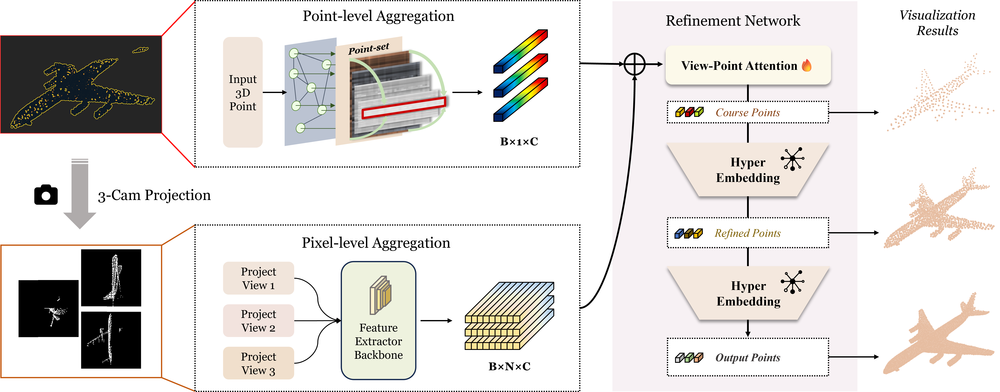
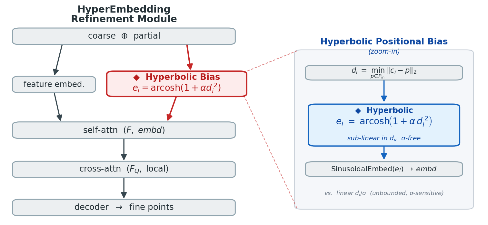

<h1 align="center">
  Hyper<sup>2</sup>: Unleashing Hyperbolic Geometry's Full Potential via Dual-Space Consistency
</h1>

<p align="center">
  
</p>

<p align="center">
  <strong>Guantian Zheng</strong><sup>1</sup> &nbsp;·&nbsp;
  <strong>Haiyang Xu</strong><sup>1</sup> &nbsp;·&nbsp;
  <strong>Tianyu Gao</strong><sup>1</sup>
</p>

<p align="center">
  <sup>1</sup>Nanyang Technological University
</p>

<p align="center">
  <a href="#framework"><strong>Framework</strong></a> &nbsp;|&nbsp;
  <a href="#hyperembedding-refinement-module"><strong>Method</strong></a> &nbsp;|&nbsp;
  <a href="#"><strong>Paper</strong></a> &nbsp;|&nbsp;
  <a href="#"><strong>Code</strong></a>
</p>

<br>

Official PyTorch implementation of **Hyper²**, a point-cloud-completion
framework that places the same `arcosh(1 + α·d²)` non-linearity at
**both** ends of the network — as a positional bias inside the
refinement attention **and** as the Chamfer training loss — under a
single shared curvature `α`. Closing this cross-geometry mismatch
delivers large gains over hyperbolic-loss-only methods at ~1.6 % extra
FLOPs.

## Framework

<p align="center">
  
</p>

Hyper² introduces two surgical changes over a Euclidean completion
backbone: (i) a **hyperbolic distance encoding** that injects
`arcosh(1+α·d²)` as a positional bias on the refinement attention, and
(ii) a **hyperbolic Chamfer loss** under the same `α`. Both operators
are scalar non-linearities on Euclidean distances over a standard
`O(N log N)` KNN graph — no manifold projection, no Poincaré-ball
machinery.

### HyperEmbedding refinement module

<p align="center">
  
</p>

Inside each refinement stage we keep the backbone's feature embedding +
self-/cross-attention + decoder, and replace **only** the positional
bias: the linear `d_i / γ` becomes `e_i = arcosh(1 + α·d_i²)`, fed
through the same sinusoidal embedding into self-attention.

## Results

### ShapeNet-55

ℓ² Chamfer × 10³ (lower is better) and F1@1 % (higher is better). CD-S /
M / H = simple / moderate / hard difficulty (25 / 50 / 75 % missing).

| Method | CD-S | CD-M | CD-H | **CD-Avg ↓** | DCD ↓ | F1 ↑ |
| :-- | :--: | :--: | :--: | :--: | :--: | :--: |
| FoldingNet | 2.67 | 2.66 | 4.05 | 3.12 | — | 0.082 |
| PCN | 1.94 | 1.96 | 4.08 | 2.66 | 0.618 | 0.133 |
| TopNet | 2.26 | 2.16 | 4.30 | 2.91 | — | 0.126 |
| PFNet | 3.83 | 3.87 | 7.97 | 5.22 | — | 0.339 |
| GRNet | 1.35 | 1.71 | 2.85 | 1.97 | 0.592 | 0.238 |
| PoinTr | 0.58 | 0.88 | 1.79 | 1.09 | 0.575 | 0.464 |
| SeedFormer | 0.50 | 0.77 | 1.49 | 0.92 | 0.558 | 0.472 |
| SVDFormer | 0.48 | 0.70 | 1.30 | 0.83 | 0.541 | 0.451 |
| **Hyper² (Ours)** | **0.37** | **0.55** | **1.01** | **0.64** | **0.528** | **0.523** |

### ShapeNet-34 (Seen + 21 Unseen)

ℓ² Chamfer × 10³ ↓ / F1@1 % ↑.

| Method | \| 34 seen \| CD-S | CD-M | CD-H | **CD-Avg ↓** | F1 ↑ | \| 21 unseen \| CD-S | CD-M | CD-H | **CD-Avg ↓** | F1 ↑ |
| :-- | --: | --: | --: | --: | --: | --: | --: | --: | --: | --: |
| FoldingNet | 1.86 | 1.81 | 3.38 | 2.35 | 0.139 | 2.76 | 2.74 | 5.36 | 3.62 | 0.095 |
| PCN | 1.87 | 1.81 | 2.97 | 2.22 | 0.154 | 3.17 | 3.08 | 5.29 | 3.85 | 0.101 |
| TopNet | 1.77 | 1.61 | 3.54 | 2.31 | 0.171 | 2.62 | 2.43 | 5.44 | 3.50 | 0.121 |
| PFNet | 3.16 | 3.19 | 7.71 | 4.68 | 0.347 | 5.29 | 5.87 | 13.33 | 8.16 | 0.322 |
| GRNet | 1.26 | 1.39 | 2.57 | 1.74 | 0.251 | 1.85 | 2.25 | 4.87 | 2.99 | 0.216 |
| PoinTr | 0.76 | 1.05 | 1.88 | 1.23 | 0.421 | 1.04 | 1.67 | 3.44 | 2.05 | 0.384 |
| SeedFormer | 0.48 | 0.70 | 1.30 | 0.83 | 0.452 | 0.61 | 1.07 | 2.35 | 1.34 | 0.402 |
| SVDFormer | 0.46 | 0.65 | 1.13 | 0.75 | 0.457 | 0.61 | 1.05 | 2.19 | 1.28 | 0.402 |
| **Hyper² (Ours)** | **0.38** | **0.53** | **0.95** | **0.62** | **0.506** | **0.44** | **0.65** | **1.30** | **0.80** | **0.465** |

### PCN

ℓ¹ Chamfer × 10³ ↓.

| Method | Plane | Cabinet | Car | Chair | Lamp | Couch | Table | Boat | **CD-Avg ↓** | DCD ↓ | F1 ↑ |
| :-- | --: | --: | --: | --: | --: | --: | --: | --: | --: | --: | --: |
| PCN | 5.50 | 22.70 | 10.63 | 8.70 | 11.00 | 11.34 | 11.68 | 8.59 | 9.64 | — | 0.695 |
| GRNet | 6.45 | 10.37 | 9.45 | 9.41 | 7.96 | 10.51 | 8.44 | 8.04 | 8.83 | 0.622 | 0.708 |
| CRN | 4.79 | 9.97 | 8.31 | 9.49 | 8.94 | 10.69 | 7.81 | 8.05 | 8.51 | — | 0.652 |
| NSFA | 4.76 | 10.18 | 8.63 | 8.53 | 7.03 | 10.53 | 7.35 | 7.48 | 8.06 | — | 0.734 |
| PoinTr | 4.75 | 10.47 | 8.68 | 9.39 | 7.75 | 10.93 | 7.78 | 7.29 | 8.38 | 0.611 | 0.745 |
| SnowflakeNet | 4.29 | 9.16 | 8.08 | 7.89 | 6.07 | 9.23 | 6.55 | 6.40 | 7.21 | 0.585 | 0.801 |
| PMP-Net++ | 4.39 | 9.96 | 8.53 | 8.09 | 6.06 | 9.82 | 7.17 | 6.52 | 7.56 | 0.611 | 0.781 |
| FBNet | 3.99 | 9.05 | 7.90 | 7.38 | 5.82 | 8.85 | 6.35 | 6.18 | 6.94 | — | — |
| SeedFormer | 3.85 | 9.05 | 8.06 | 7.06 | 5.21 | 8.85 | 6.05 | 5.85 | 6.74 | 0.583 | 0.818 |
| SVDFormer | 3.62 | 8.79 | 7.46 | 6.91 | 5.33 | 8.49 | 5.90 | 5.83 | 6.54 | 0.536 | 0.841 |
| **Hyper² (Ours)** | **3.52** | **8.54** | **7.31** | **6.60** | **5.19** | **8.27** | **5.83** | **5.67** | **6.36** | **0.528** | **0.854** |

### KITTI (Real LiDAR)

Fidelity (input preservation) and MMD (against ShapeNet cars). Model
pre-trained on PCN then fine-tuned on ShapeNetCars.

| Method | PCN | FoldingNet | TopNet | NSFA | PFNet | CRN | GRNet | SeedFormer | SVDFormer | **Hyper² (Ours)** |
| :-- | --: | --: | --: | --: | --: | --: | --: | --: | --: | --: |
| Fidelity ↓ | 2.235 | 7.467 | 5.354 | 1.281 | 1.137 | 1.023 | 0.816 | 0.151 | 0.052 | **0.026** |
| MMD ↓ | 1.366 | 0.537 | 0.636 | 0.891 | 0.792 | 0.872 | 0.568 | 0.516 | 0.145 | **0.109** |

### Ablations (ShapeNet-55)

Dual-space consistency — only the Hyp.–Hyp. row delivers the gain:

| Loss | Encoder | CD ↓ | F1 ↑ |
| :--: | :--: | :--: | :--: |
| Euc. | Euc. | 0.83 | 0.451 |
| Hyp. | Euc. | 0.73 | 0.467 |
| Euc. | Hyp. | 0.82 | 0.453 |
| **Hyp.** | **Hyp.** | **0.64** | **0.523** |

Curvature `α` sweep (optimum at α = 0.5):

| α | 0.1 | 0.2 | **0.5** | 1.0 | 2.0 |
| :--: | :--: | :--: | :--: | :--: | :--: |
| CD ↓ | 0.69 | 0.66 | **0.64** | 0.67 | 0.71 |
| F1 ↑ | 0.498 | 0.511 | **0.523** | 0.507 | 0.489 |

### Computational overhead

| Backbone | FLOPs | Params | Inference (RTX 3090) |
| :-- | :--: | :--: | :--: |
| SVDFormer | 12.3 G | 23.1 M | 47 ms |
| **Hyper² (Ours)** | **12.5 G** *(+1.6 %)* | **23.1 M** *(+0 %)* | **48 ms** *(+2.1 %)* |

## Getting Started

### Environment

```bash
git clone https://github.com/Ethan-Zheng136/Hyper-2.git
cd Hyper-2

conda create -n hyper2 python=3.8 -y
conda activate hyper2

pip install torch torchvision           # CUDA build matching your driver
pip install numpy easydict tqdm matplotlib opencv-python h5py munch open3d transforms3d
```

Build the CUDA extensions:

```bash
cd metrics/CD/chamfer3D && python setup.py install --user && cd ../../../
cd metrics/EMD            && python setup.py install --user && cd ../../
cd pointnet2_ops_lib      && python setup.py install --user && cd ../
```

### Datasets

Edit `*_POINTS_PATH` and `CONST.WEIGHTS` in `config_55.py` /
`config_pcn.py` to point at your local copy of **ShapeNet-55 / 34**
and **PCN**. Split files live under `datasets/`.

### Train

```bash
bash train_pcn.sh        # PCN
bash train_55.sh         # ShapeNet-55 / 34
```

### Test

Point `cfg.CONST.WEIGHTS` at your checkpoint, then:

```bash
bash test_pcn.sh
bash test_55.sh
```

The shared curvature `α = 0.5` is set inside the hyperbolic ops:
`models/SVDFormer.py` (`hyper_cd_distance`, `arcosh`) and
`utils/loss_utils.py` (`calc_cd_like_hyperV2`, `arcosh`). Change both
sites together if you sweep it.

## Acknowledgements

This codebase builds on **SVDFormer** (ICCV 2023) and the hyperbolic
Chamfer formulation of **HyperbolicCD** (ICCV 2023). We thank the
authors for releasing their code.


## License

Released under the [MIT License](LICENSE).
